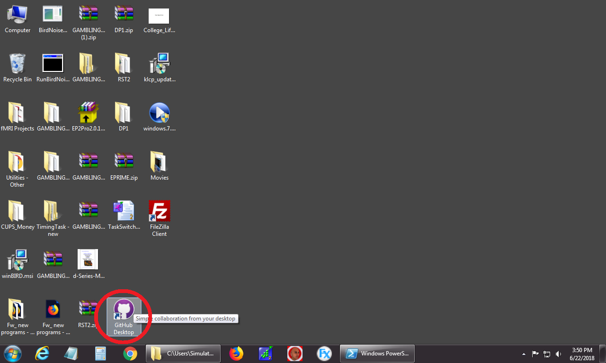
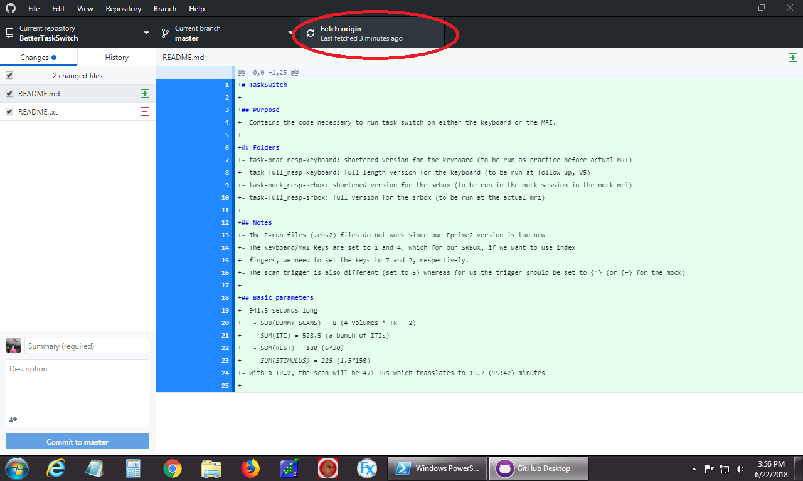
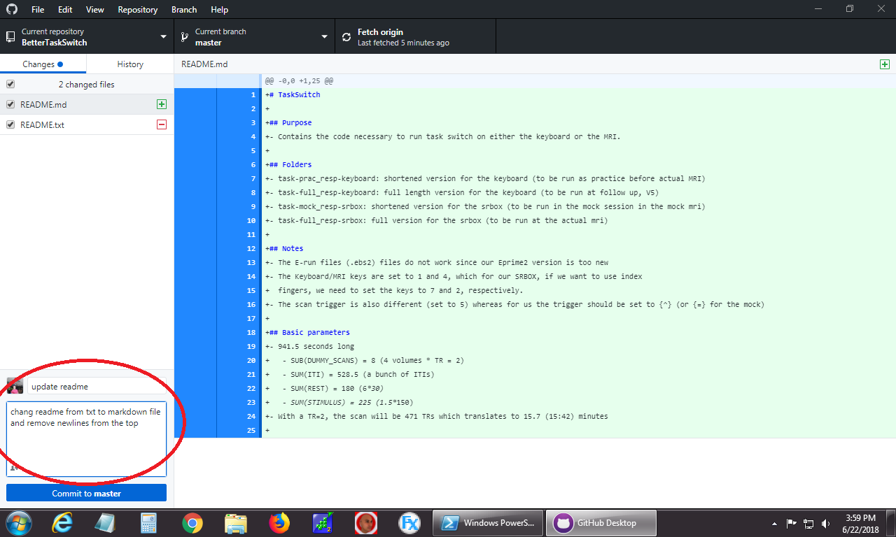
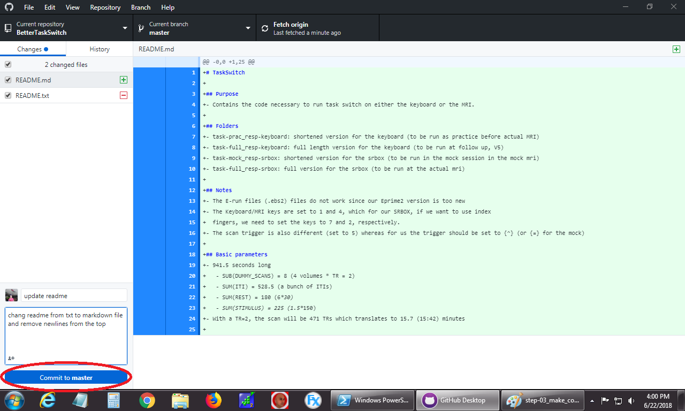
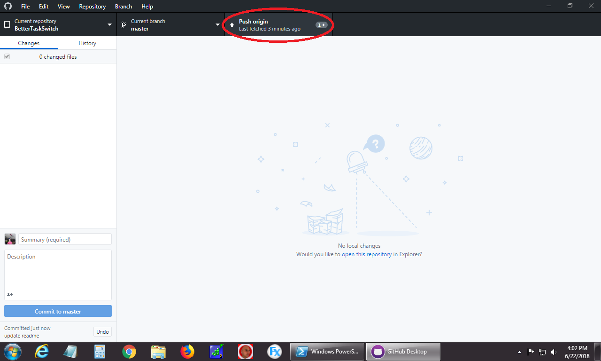

# How to backup data with git
git is a [distributed version control system][1] that allows us to keep tight control of our data. 
Once the data are tracked with git, we will see any changes to the data and be able to track any unintended overwrites or deletion of participant data.
This guide is using [github desktop][2] to keep the data under control and give us peace of mind while analyzing data.

## Step 0: collect the data
The steps to back up the data will be completed _after_ the session with the participant is over.

## Step 1: Open github desktop
Open github desktop, the desktop icon should be on the main screen of your computer

## Step 2: Fetch changes from github
The correct repository should already be open (however, there may be multiple repositories to switch between).
We want to make sure our local copy of the data is the most up to date version, so we will ask the server (github) to "fetch" any changes and apply them to our current repository.

## Step 3: Add/Commit changed files
If files have been changed in the repository, github desktop should already see those changed files and have them checked.
We want to keep track of those changes so we will write a commit message so we can make a summary of what files are being added/modified.
Most commonly, your commit message will be: `add data for sub-<label>`, where \<label\> is the subject study identifier.
In the description box, you can provide a more detailed explanation of the changes being made, in case additional files were modified unexpectedly.

## Step 4: Make the commit
Once the title and description of the commit is set, select the commit to master button.

## Step 5: push changes to origin
Finally we will push the changes to github, backing up our data and making it easily accessible to other lab members to analyze the data.

And you're done (with this task's data anyway). 
This process is important to maintain validity of the data and makes the steps from data collection to pretty graphs to impactful results much faster, so thank you for all your help!

For questions please contact: <james-kent@uiowa.edu> via this email, in slack, or in person.

[1]: (https://git-scm.com/book/en/v2/Getting-Started-About-Version-Control#_distributed_version_control_systems)
[2]: (https://desktop.github.com/)